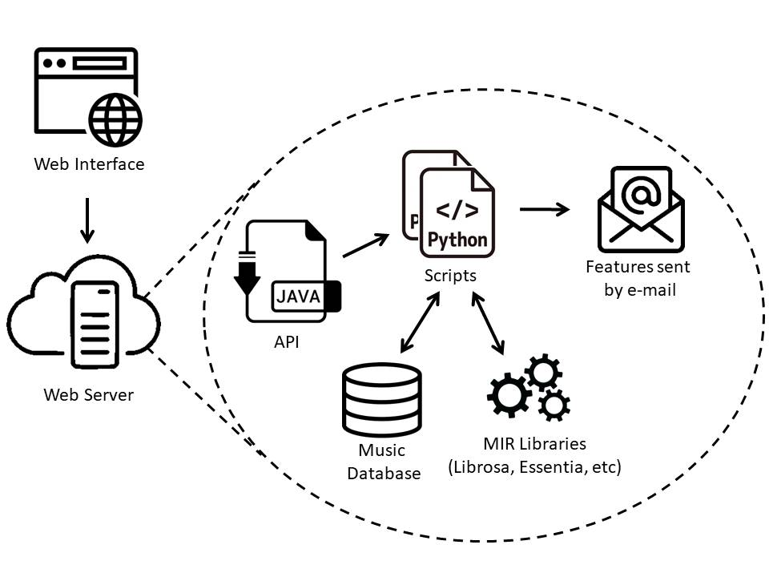

# Rhapsody

Rhapsody is a web application for music features extraction. The web interface provides an easy way to select wich features, music data sets and the format for the extracted features that the users want to.


The image above shows, in a simple way, how the application works. It starts with the user setting the information in the web interface, that will be send to the web server. 
On the server, the work begins with the Java API, that organizes the user's information and call the Python script.Therefore, the script uses a MIR libraries to extract the selected features from the music database, also selected by the user. Finally, the script sends the result file (in the user's format choice) to the email address settled.

## Getting Started

To use the plataform, follow the instructions below.

### Prerequisites

Rhapsody is a web application for music features extraction. The web interface provides an easy way to select wich features, music data sets and the format for the extracted features that the users want to.


* Java JRE 1.8 (https://www.oracle.com/br/java/technologies/javase-jre8-downloads.html)
* Apache Tomcat 9.0 (https://tomcat.apache.org/download-90.cgi)


## Deployment


To make the deploy of the application, first we need to make a .war file of the java project. For this, we can just export the project using a IDE (like ecplipse, for example) or use the jar tool of JDK:
Open the prompt in the project folder, then execute the command:
```
jar -cvf projectName.war *
```
Get the war file into the webapp folder of the tomcat server path(example: "C:\apache-tomcat-9.0.37\webapps\theWarFile.war").
At this point, we just need to start the tomcat. On windows, start the prompt command at the bin folder of tomcat(example : "C:\apache-tomcat-9.0.37\bin\"), 
then execute the "startup.bat". At Linux, execute the "startup.sh". Done this, the application will be working in the localhost:8080.

Windows:
```
>cd /path_to_tomcat_folder/bin
>startup.bat
```
Linux:
```
$ cd /path_to_tomcat_folder/bin
$ sh startup.sh 
or 
$ ./startup.sh 
```

## Built with

* [Java]
(https://www.oracle.com/br/java/) – The language used in the Back-end.
* [Spring Framework]
(https://spring.io/) – The framework used to perform the web services.
* [Bootstrap]
(https://getbootstrap.com/) – The framework used in the front-end.
* [Apache Tomcat]
(https://tomcat.apache.org/) - The software used to deploy the application.

## Authors

* **João Arthur Fujii Manso** - *Initial work* – [Hibikiza] (https://github.com/Hibikiza/)
* **Marcos Aurelio Domingues** - *Advisor* – [maddomingues] (https://github.com/maddomingues)
